1. [Cách hoạt động](#cách-hoạt-động)

## Cách hoạt động

Check trùng requestId bằng cách kiểm tra xem key có tồn tại trong redis hay không nếu có trả về true và ném vào exception. Nếu không có thì lưu vào redis để expire là 864000s

```
"requestId": "hjawfhwqsnmkfu123894y2222"
```
<br>

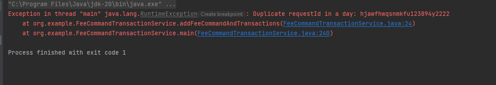

<br>
Check thời gian requestTime so với thời gian hiện tại không quá 10 phút nếu quá 10 phút thì ném vào exception

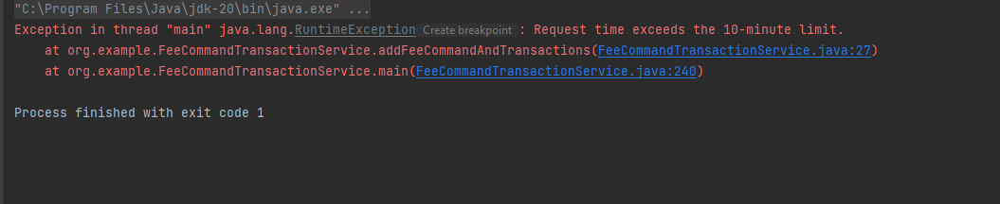

<br>

Thêm mới một lệnh thu phí và các giao dịch thu phí, trạng thái “Khởi tạo”, theo bản tin:

<br>

```json
{
  "requestId": "hjawfhwqsnmkfu123894y2222",
  "requestTime": "20230623155051",
  "commandCode": "FC230623523226",
  "totalRecord": 1000,
  "totalFee": 1000,
  "createdUser": "admin",
  "createdDate": "20230623155051"
}
```
Thêm vào bảng FEE_COMMAND
<br>

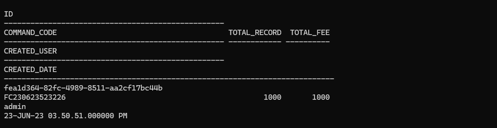
Thêm vào bảng FEE_TRANSACTION
<br>
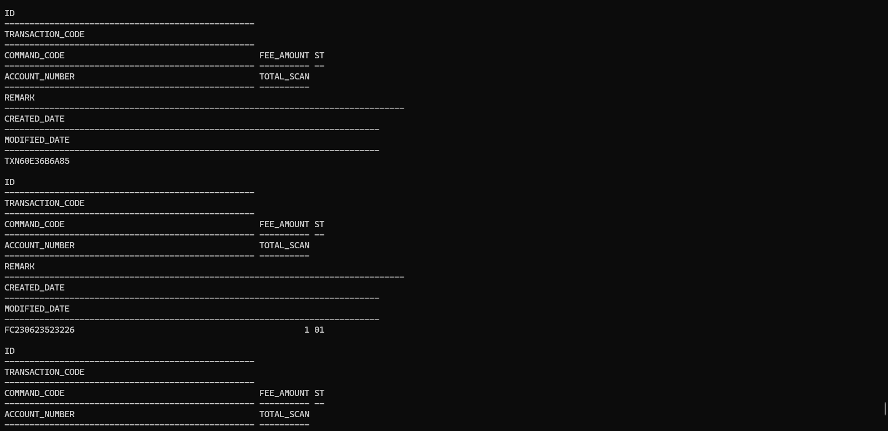
<br>
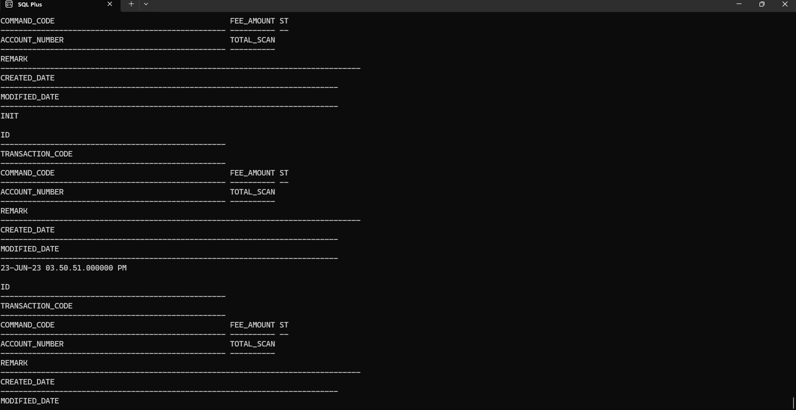
<br>
Lấy thông tin của tất cả các giao dịch phí có chứa mã "commandCode"
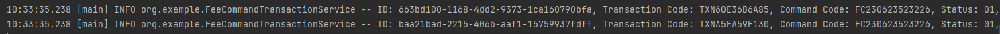
<br>
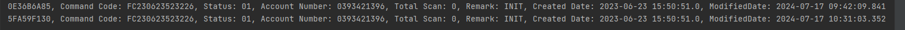

<br>
Cập nhật thông tin cho các giao dịch trên: TOTAL_SCAN = 1, MODIFIED_DATE bằng thời gian cập nhật, STATUS = “02”.
<br>

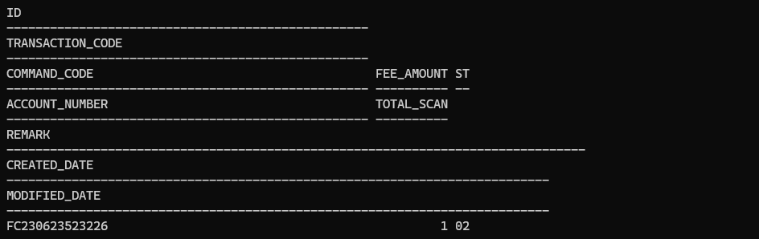

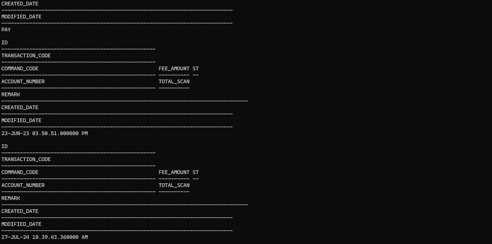
<br>
Tạo một cronjob mỗi 3 phút lấy ra các giao dịch có số lần TOTAL_SCAN < 5, STATUS = “02”.
<br>

Trước 3 phút
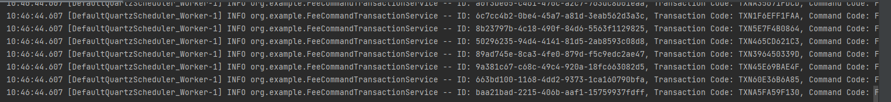
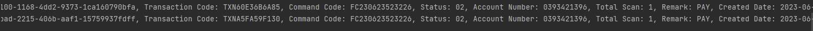
Sau 3 phút
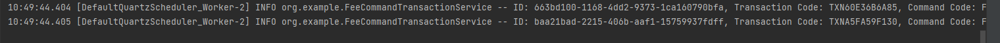
<br>

Cập nhật TOTAL_SCAN + 1, MODIFIED_DATE bằng thời gian cập nhật. TOTAL_SCAN = 5 THÌ STATUS = "03"
<br>

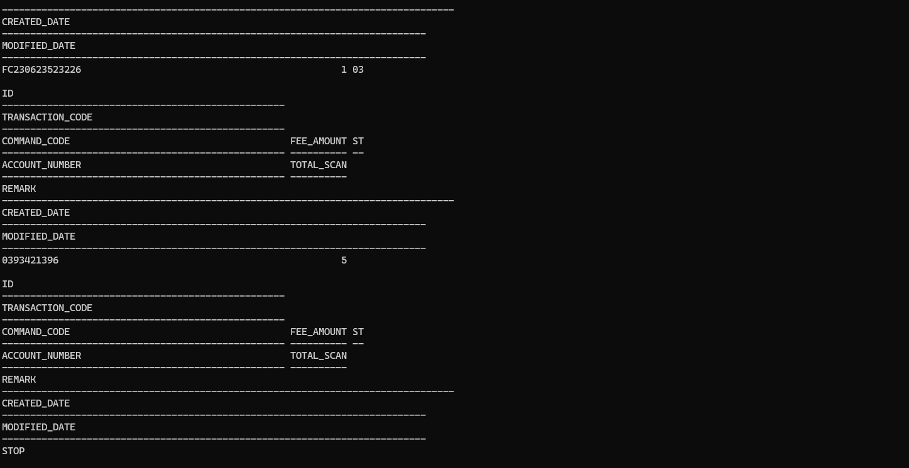
