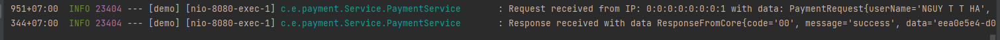
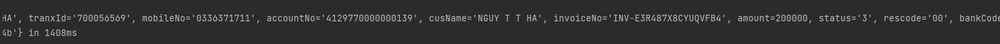
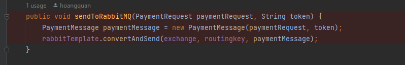
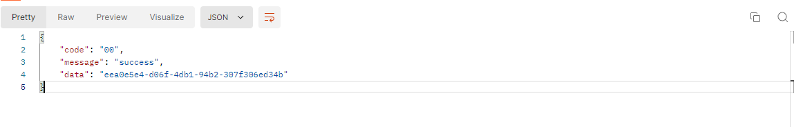
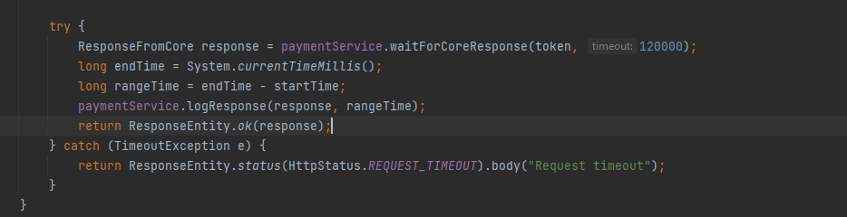
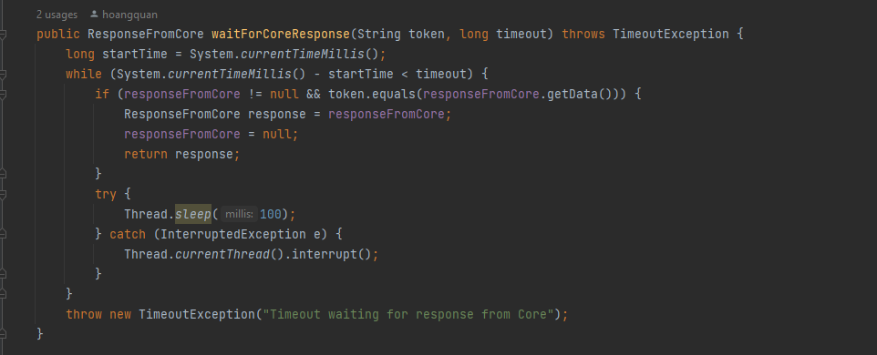
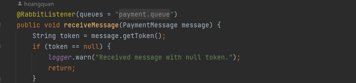
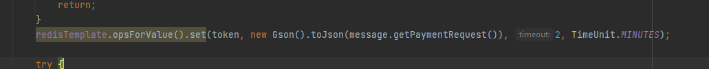
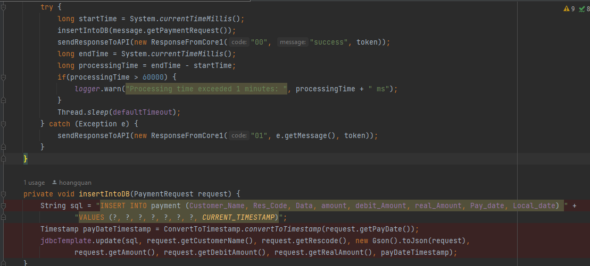
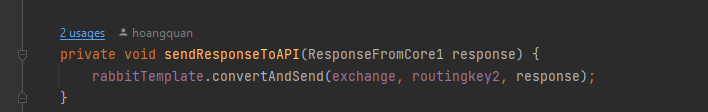

1. [Api](#api)
2. [Core](#core)

## Api
Có log request, response: ghi log bản tin, log IP gọi, thời gian từ lúc request đến lúc response: 



<br>

Bản tin sau đó sẽ được gửi cùng với token thông qua rabbitMQ( Direct Exchange)


Nhận phản hồi từ Core trả lại thông tin cho client


Thời gian chờ tối đa (timeout) của mỗi request là 2 phút


## Core

Bên Core nhận được message chứa token và bản tin


Lưu key = token và value = bản tin dạng chuỗi json với thời gian expire là 2 phút


Insert vào db:  
- Nếu thành công trả về cho API qua RabbitMQ: mã lỗi: 00, message: success, data: token. 
- Nếu không thành công: Trả về cho API qua RabbitMQ: mã lỗi: 01, message: fail, data: token.
  
  

Nếu thời gian xử lý quá 1 phút thì sẽ ghi log để theo dõi hệ thống ( với endTime là thời gian thực hệ thống kết thúc và startTime là thời gian thực của hệ thống lúc bắt đầu)
```
processingTime = endTime - startTime; 
```


Hệ thống nghỉ 30s

