# Mục lục

1. [Giới thiệu](#giới-thiệu)
    - [Cách hoạt động](#hoạt-động)
2. [Cài đặt](#cài-đặt)
3. [Sử dụng](#sử-dụng)
    - [Chạy chương trình RabbitMQ Management](#chạy-chương-trình-trên-rabbitmq-management)
    - [Chạy SpringBoot](#chạy-springboot)

## Giới thiệu

RabbitMQ là một message broker (trung gian tin nhắn)  giúp hệ thống trao đổi dữ liệu với nhau

### Hoạt động

Producer: Chịu trách nhiệm sản xuất và gửi các tin nhắn tới RabbitMQ

Message Queue: Là nơi các tin nhắn được lưu trữ tạm thời trước khi được xử lý bởi các consumer

Exchange: Nhận tin nhắn từ producer định tuyến đến queues phù hợp

Binding: Liên kết giữa exchange và queues

### Các loại exchange

Direct Exchange: Định tuyến tin nhắn từ exchange tới hàng đợi dựa trên routing key của tin nhắn( routing key của message khớp với routing key của queue)

Default exchange: Là một direct exchange mặc định, cho phép định tuyến message trực tiếp tới queue với tên là routing key của message

Fanout Exchange: Message được định tuyến đến tất cả các queue được liên kết với nó, bất kể chúng có routing key như nào

Topic Exchange: Định tuyến dựa trên topic

Header exchange: Định tuyến dựa trên header thay vì routing key

Consumer: Nhận và xử lý các tin nhắn từ RabbitMQ
## Cài đặt

Chạy câu lệnh ở cmd để tải về docker: docker run -it --rm --name rabbitmq -p 5672:5672 -p 15672:15672 rabbitmq:3.13-management

## Sử dụng

### Chạy chương trình trên RabbitMQ Management

Direct exchange:

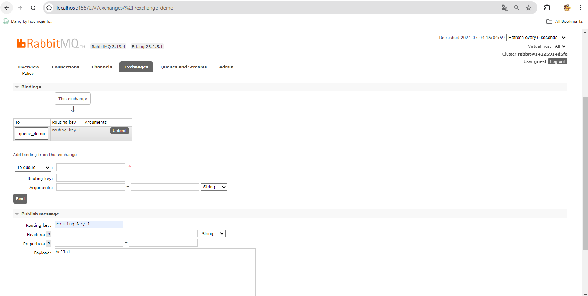

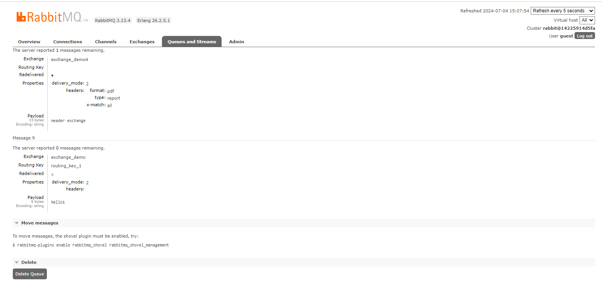

Fanout exchange:

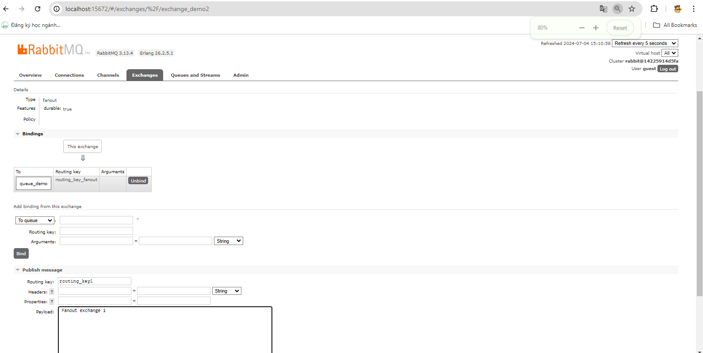

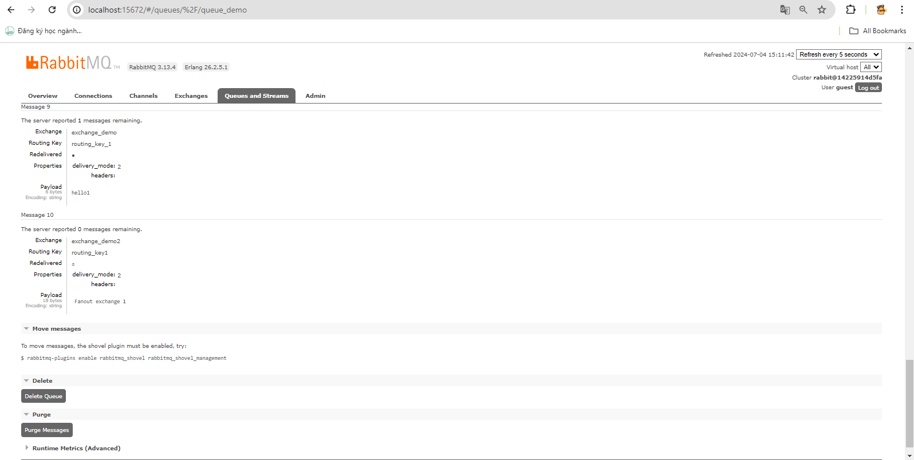

Topic exchange:

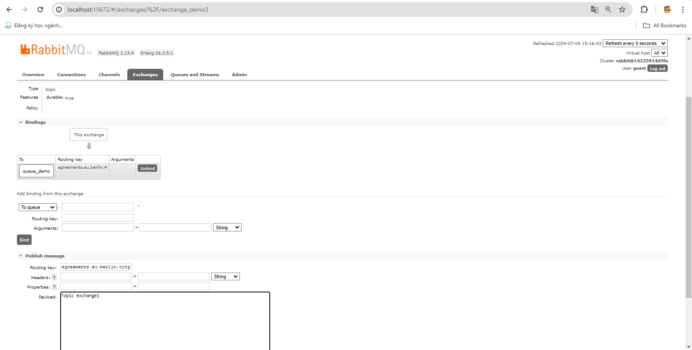

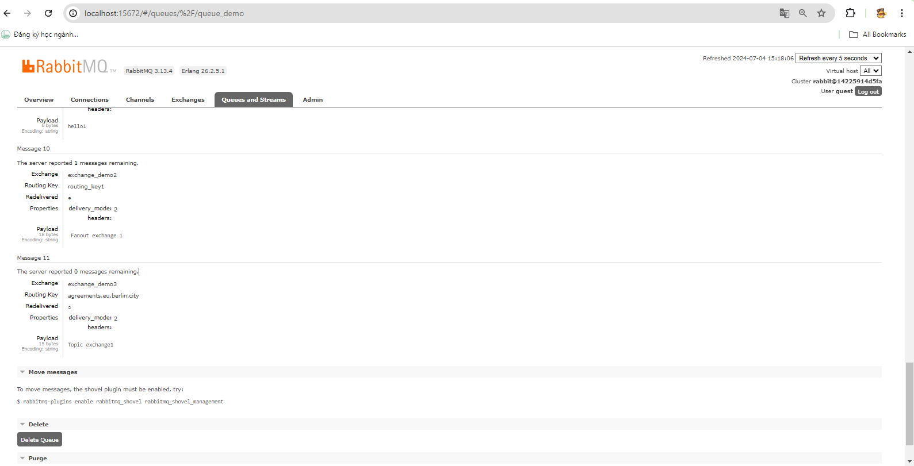

Header exchange:

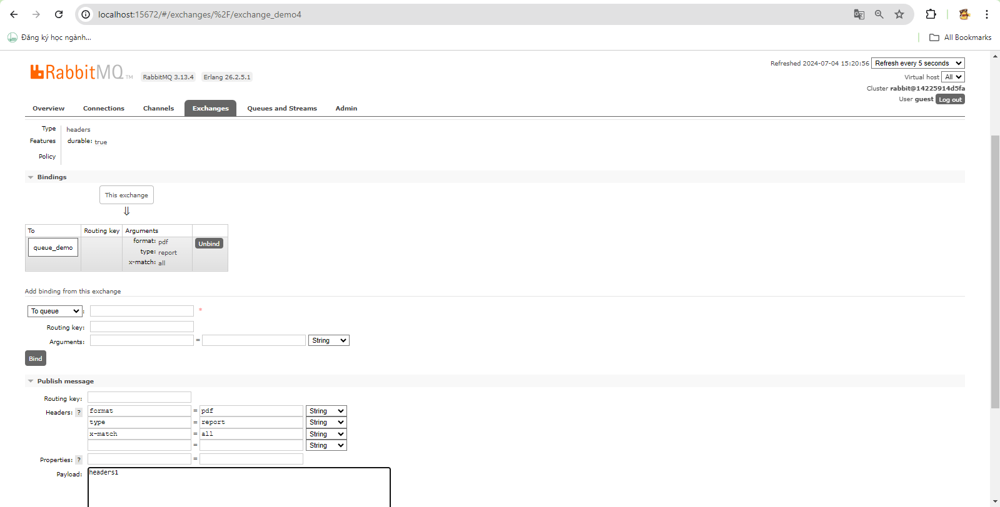

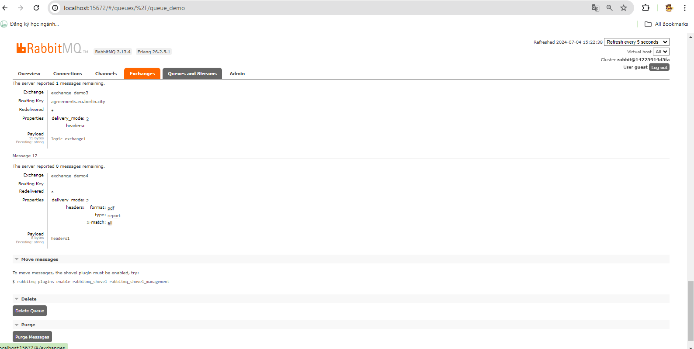

### Chạy SpringBoot

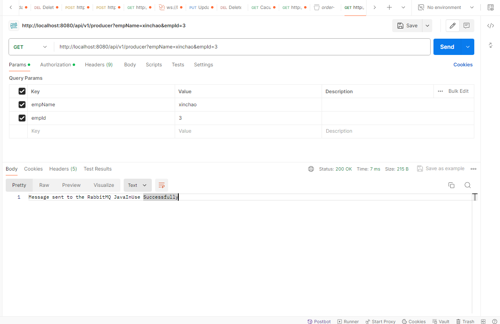

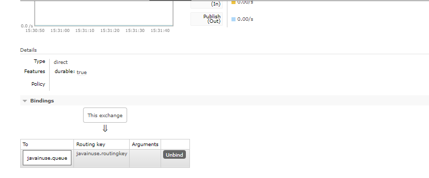

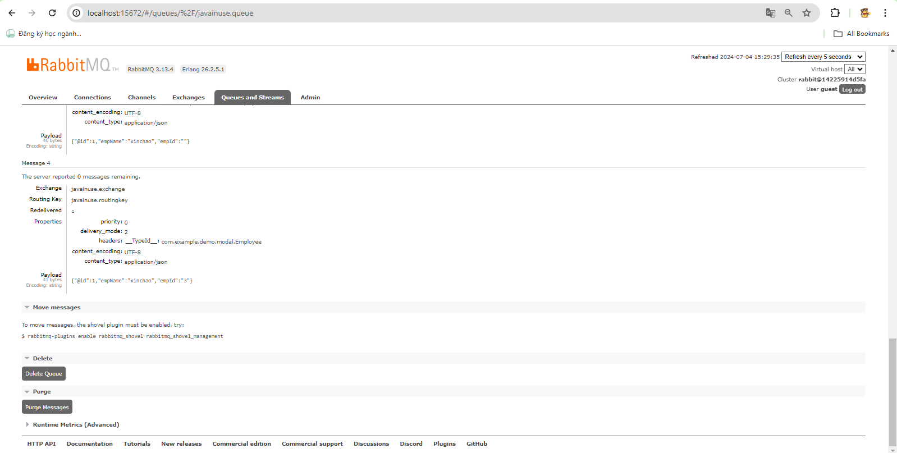

