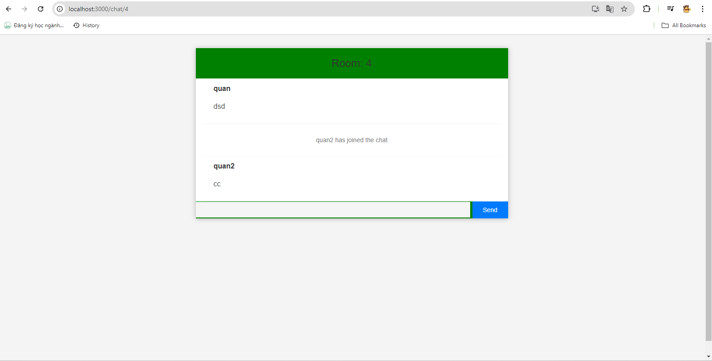
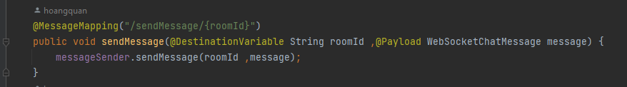
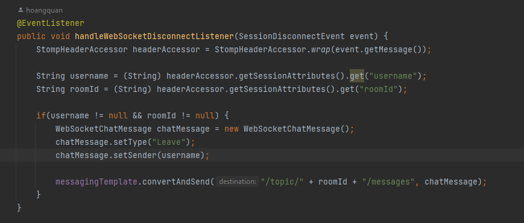

1. [Cách thức hoạt động](#cách-thức-hoạt-động)

## Cách thức hoạt động

Khi người dùng đăng nhập thì tên người dùng sẽ được lưu vào localstorage ở FE để hiển thị tên khi submit tên cùng với đó được điều hướng đến trang rooms

Tại đây có thể xóa, hoặc tạo một phòng tùy ý.

BE sẽ lưu người dùng và quản lý đến khi hết phiên chat

Khi người dùng gửi một tin nhắn

Tín nhắn được gửi qua rabbitmq với exchange, routing key dạng DirectExchange và message

Sau khi tin nhắn được nhận bắn qua websocket với destination = "/topic/messages"

Hiển thị tin nhắn và các tin phía trước và real-time các tin nhắn

Khi người dùng thoát sẽ thông báo ở FE và khi đó BE sẽ setTye = "leave"

Hiển thị thông báo ở FE
