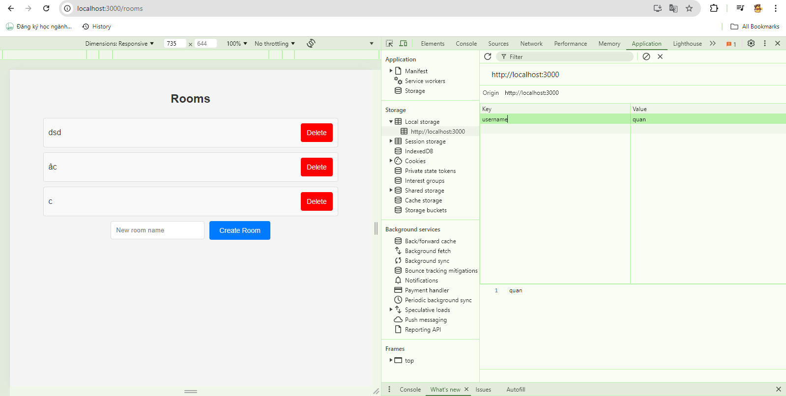
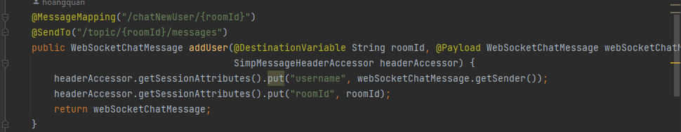
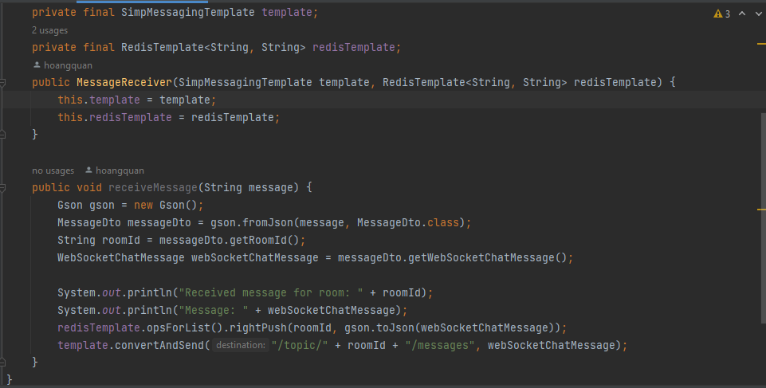
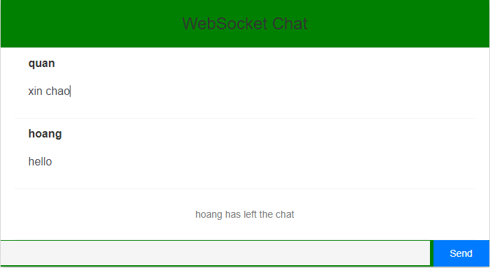
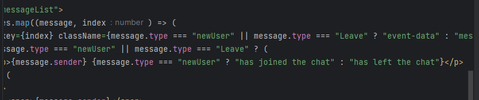

1. [Cách thức hoạt động](#cách-thức-hoạt-động)

## Cách thức hoạt động

Khi người dùng đăng nhập thì tên người dùng sẽ được lưu vào localstorage ở FE để hiển thị tên khi submit tên cùng với đó được điều hướng đến trang rooms

Tại đây có thể xóa, hoặc tạo một phòng tùy ý.

 

Phòng sẽ được tạo và dùng Ws để người khi 2 người cùng trang /rooms có thể nhìn thấy phòng được tạo

BE sẽ lưu người dùng và quản lý đến khi hết phiên chat

Giao diện phòng chat

Khi người dùng gửi một tin nhắn

Tín nhắn được gửi qua redis với đến key = "xin chao" và value = "message" và roomId để biết tin nhắn đang ở phòng có Id nào

Sau khi tin nhắn được nhận bắn qua websocket với roomId và tin nhắn. Cùng với đó lưu tin nhắn vào redis.

Hiển thị tin nhắn và các tin phía trước và real-time các tin nhắn

Lưu tin nhắn vào redis để tin nhắn lúc nào cũng có thể nhìn thấy dù vào sau hay thoát ra.

Khi người dùng thoát sẽ thông báo ở FE và khi đó BE sẽ setTye = "leave"

Hiển thị thông báo ở FE
